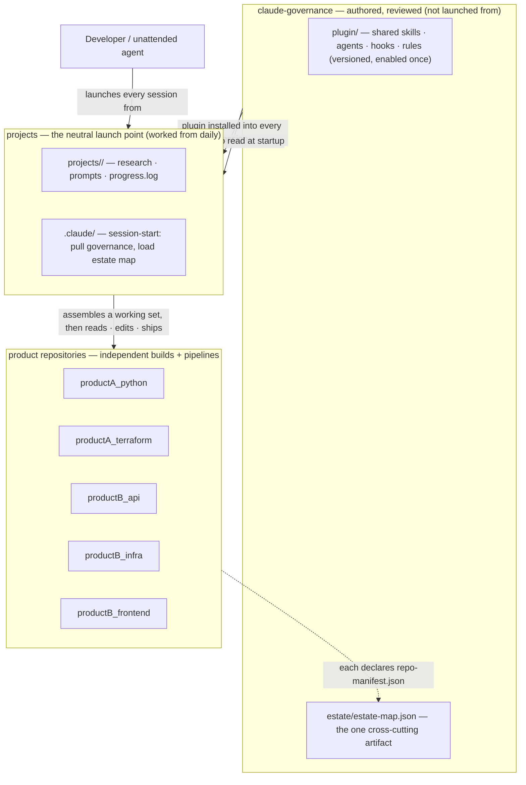

# Repository Structure — Design Rationale

**Companion to:** [`architecture-narrative.md`](./architecture-narrative.md).
**Purpose:** Explain *why* the repositories are arranged the way they are. For the exhaustive annotated
file tree, see the top-level [`STRUCTURE.md`](../../../STRUCTURE.md); this doc covers the reasoning.

In real life each directory below is its own git repository. In this illustration they're plain folders
so the whole pattern reads in one place.

---

## The shape

Three kinds of repository, three different jobs:

- **`claude-governance`** is *authored and reviewed*. It is the home of the shared plugin and the estate
  map. Nobody works from it day to day.
- **`projects`** is *worked from every day*. It is neutral ground — the consistent launch point — and
  the home of stateful project folders.
- **product repositories** are *independent*. Each owns its own `.claude/` capabilities and declares its
  facts in a `repo-manifest.json`.

---

## Why each boundary exists

### Why governance is its own repository
Shared capability needs to be reviewed carefully and changed rarely. If it lived in the same place
people did daily work, the churn of project folders and running notes would sit on top of the team's
carefully-reviewed configuration. Keeping it separate lets it be versioned and released like a real
dependency — which is exactly what the plugin is.

### Why the plugin replaces copying or linking
An earlier version of this design symlinked each repository's skills into a central location, tagged
with a provenance prefix. That worked but it drifted: the links were per-machine and invisible to
history. A versioned plugin solves the same problem properly — single-sourced, installed once, updated
by version bump. So there are no `pa-`/`pb-` prefixed links anymore.

### Why the estate map can't be decentralized
Almost everything can live either in the plugin (if it's shared and generic) or in a product repository
(if it's specific to that repository). One thing can't: the assembled view of every repository, how each
deploys, the cross-account credential map, and the dependency edges between them. No single repository
knows it, and a generic plugin can't carry team-specific facts. So it gets one governed home, in the
governance repository, assembled from each repository's declared `repo-manifest.json`.

### Why developers launch from a neutral repository
Most changes touch several repositories, and there's rarely a single "right" one to start from. A
neutral launch point avoids privileging any one repository, gives stateful work a fixed and findable
home, and gives the session one consistent place to orient itself before it knows which repositories a
task will touch.

### Why repository-specific capability stays put
A skill that only makes sense for one repository belongs beside that repository's code, owned by the
people who own the code. The assistant picks it up when that repository is in the working set. This
keeps the shared plugin general and keeps ownership where the knowledge actually is.

---

## The one idea to take away

Shared capability is **installed** (a versioned plugin from the governance repository). Repository facts
are **declared** (a manifest in each repository, assembled into one estate map). Developers **launch**
from neutral ground and the assistant pulls in only the repositories a task needs. Nothing is copied by
hand, and the only thing that must be centralized — the estate map — has exactly one reviewed home.
