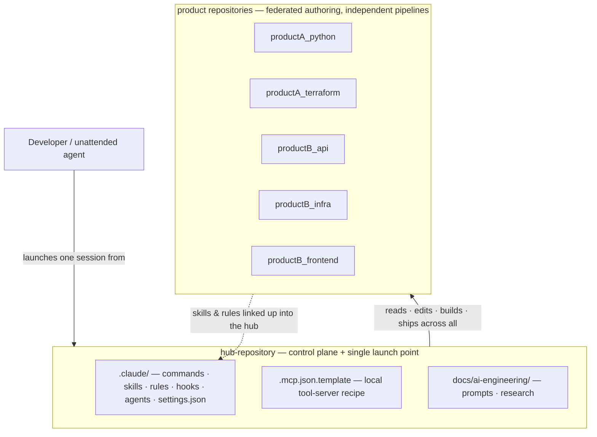

# Repository Structure — Hub + Product Repos

**Companion to:** [`architecture-narrative.md`](./architecture-narrative.md).
**Purpose:** Show *where things physically live* — the hub, the product repos around it, and the
`.claude/` and `docs/` layout inside each, with example filenames.

In real life each top-level directory is its own git repository. In this illustration they're plain
folders so the whole pattern reads in one place.

---

## Legend

| Marker | Meaning |
|---|---|
| `(committed)` | Tracked in git — reviewed, shared with the team |
| `(gitignored)` | Local to one machine — generated at setup, or personal |
| `(symlink → Repo)` | A live link to a file owned by another repo; edit it there, the hub sees it instantly |
| prefix `pa-` / `pb-` | Provenance tag — which product owns a composed item; hub-native items have no prefix |

---

## The relationship (control plane over a polyrepo)



Two directions: the hub's session **reaches down** into every product repo to do the work; each repo
**pushes its capabilities up** into the hub so they're available from the one launch point.

---

## Hub repository

```
hub-repository/                            <- the assistant is always launched from here
├── CLAUDE.md                              (committed) always-loaded hub context
├── .claude/
│   ├── settings.json                      (committed) permissions + hook wiring
│   ├── settings.local.json                (gitignored) personal tool grants
│   ├── commands/                          single-file skills
│   │   ├── ship.md                        (committed)  build -> commit -> push -> review
│   │   ├── oncall.md                      (committed)  triage incoming work
│   │   ├── setup.md                       (committed)  bootstrap a new developer
│   │   ├── pa-etl-validate.md             (symlink -> productA_python)
│   │   └── pb-api-contract-check.md       (symlink -> productB_api)
│   ├── skills/
│   │   └── improve-assistant/
│   │       ├── SKILL.md                   (committed) meta-skill: edits the config itself
│   │       └── examples/
│   │           ├── skill-template.md
│   │           ├── rule-template.md
│   │           └── hook-template.sh
│   ├── rules/                             loaded on demand by file-path match
│   │   ├── data-handling.md               paths: **/*.sql, **/*.py
│   │   ├── commit-style.md                (unconditional)
│   │   ├── assistant-config-governance.md paths: .claude/**
│   │   └── pb-api-conventions.md          (symlink -> productB_api)
│   ├── hooks/                             scripts the harness runs on events
│   │   ├── session-start-state.sh         SessionStart -> report each repo's state
│   │   ├── validate-cwd.sh                PreToolUse   -> gate risky git commands
│   │   ├── validate-style.sh              PostToolUse  -> check edits immediately
│   │   └── check-uncommitted.sh           Stop         -> warn about dirty repos
│   └── agents/                            subagent specialists
│       ├── sql-reviewer.md
│       └── infra-diagnostician.md
├── .mcp.json.template                     (committed)  tool-server recipe (placeholders)
├── .mcp.json                              (gitignored) generated per developer at setup
└── docs/
    └── ai-engineering/
        ├── architecture-narrative.md
        ├── repository-structure.md        <- this file
        ├── prompts/
        │   └── phase-rollout-prompt.md
        └── research/
            └── capability-audit.md
```

---

## Product repositories

Each follows the same shape: a `.claude/` that is the **source of truth** for its own
skills/rules/hooks, and a `docs/<Product>/` split into `prompts/` and `research/`.

### productA_python — Python service / data pipeline
```
productA_python/
├── CLAUDE.md
├── .claude/
│   ├── commands/etl-validate.md           --> hub composes as  pa-etl-validate.md
│   ├── rules/python-conventions.md        paths: **/*.py
│   └── hooks/validate-python-syntax.sh    PostToolUse
├── src/etl/pipeline.py
└── docs/productA/
    ├── prompts/etl-refactor-prompt.md
    └── research/dataframe-library-options.md
```

### productA_terraform — ProductA infrastructure-as-code
```
productA_terraform/
├── CLAUDE.md
├── .claude/
│   ├── commands/infra-plan.md             --> hub composes as  pa-infra-plan.md
│   ├── rules/terraform-patterns.md        paths: **/*.tf
│   └── hooks/validate-tf-fmt.sh           PostToolUse
├── modules/network/main.tf
└── docs/productA/
    ├── prompts/module-migration-prompt.md
    └── research/state-backend-options.md
```

### productB_api — ProductB backend API
```
productB_api/
├── CLAUDE.md
├── .claude/
│   ├── commands/api-contract-check.md     --> hub composes as  pb-api-contract-check.md
│   ├── rules/api-conventions.md           paths: **/*.ts  (also linked up)
│   └── hooks/validate-openapi.sh          PostToolUse
├── src/routes/health.ts
└── docs/productB/
    ├── prompts/endpoint-scaffold-prompt.md
    └── research/auth-model-comparison.md
```

### productB_infra — ProductB infrastructure-as-code
```
productB_infra/
├── CLAUDE.md
├── .claude/
│   ├── commands/infra-plan.md
│   ├── rules/terraform-patterns.md        paths: **/*.tf
│   └── hooks/validate-tf-fmt.sh           PostToolUse
├── modules/service/main.tf
└── docs/productB/
    ├── prompts/network-topology-prompt.md
    └── research/multi-region-tradeoffs.md
```

### productB_frontend — ProductB web UI
```
productB_frontend/
├── CLAUDE.md
├── .claude/
│   ├── commands/component-new.md          --> hub composes as  pb-frontend-component-new.md
│   ├── rules/frontend-conventions.md      paths: **/*.tsx
│   └── hooks/validate-eslint.sh           PostToolUse
├── src/components/Button.tsx
└── docs/productB/
    ├── prompts/design-system-prompt.md
    └── research/state-management-survey.md
```

---

## The one idea to take away

A product repo's `.claude/` is **authored where the code lives** and **composed where the assistant
launches**. You write a skill or rule next to the code it governs, tag it with a provenance prefix, and
the hub links it in — so one launch point gives you every team's capabilities, while ownership stays
distributed across the repos.
